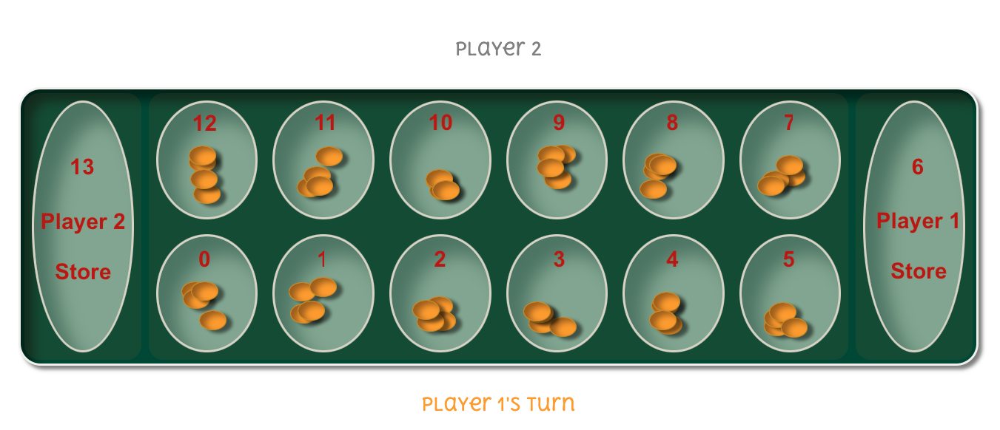

Mancala - THE game
======================

Mancala is an ancient two-player board game that traces its roots back to Africa and the Middle East. It is traditionally played with a wooden board and stones, beads or seeds as pieces. This project replicates this as a braowser game.

Background
----------------------

Mancala has a long history that spans centuries and is played in various forms around the world. The game is known by different names, such as _Oware_ and _Kalah_.

If you're not familiar with Mancala, you can learn more about the game and its rich history by visiting the [Mancala Wikipedia website](https://en.wikipedia.org/wiki/Mancala).

## What Can Mancala Do?

Mancala is a classic strategy game where two players compete to collect as many beads (seeds) as possible in their respective pits or cups. The game is a blend of strategic thinking, tactical maneuvering, and a touch of luck. This digital version of Mancala, aims to replicate the real-life board game experience in an online setting.

## How to play the game

To play the online game, please click [here](https://annabelleb4509.github.io/Project1_Mancala/).

### Setup the game

This version of Mancala is a 2 player game.

The Mancala board consists of two rows of six small pits (holes) and two larger pits, one at each end. The larger pits are called "Mancalas" (stores).

Each player controls one of the two rows, and their Mancala is the large pit to their right (end of their row).

At the start, each of the 12 small pits has 4 beads.

### Basic rules of Mancala

The objective of the game is to capture more beads in your Mancala than your opponent. The game proceeds in turns.
On your turn, choose one of the pits in your row that contains beads. You'll pick up all the beads from that pit and distribute them one by one in a counter-clockwise direction into the other pits and your Mancala, skipping your opponent's Mancala.

If the last stone you drop lands in your Mancala, you get another turn.

If the last stone you drop lands in an empty pit on your side, and the opposite pit on your opponent's side has beads, you capture those beads and place them in your Mancala.

#### Winning:

The game ends when one player's row is completely empty. The player with the most beads in their Mancala wins the game.

## Technologies

### Features to come

Features to be added that will improve the experience for the user playing the game:

* Numbers on the board that indicate the number of beads in each pit.

